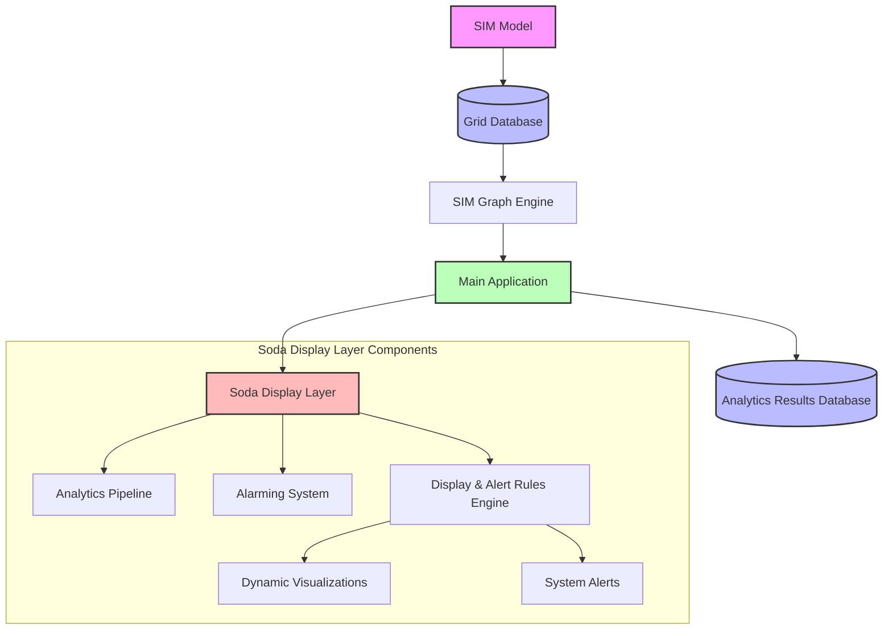

# Architectural Overview

This document provides a high-level overview of the Griddy architectural data flow and system components.

## System Architecture Diagram

## Data Flow Description

1.  **SIM Model:** The source of truth for the power system topology and properties.
2.  **Grid Database:** Stores the persistent state of the grid model and historical readings.
3.  **SIM Graph Engine:** Processes the raw relational data into a high-performance Property Graph for traversal and analysis.
4.  **Main Application:** The core logic server that orchestrates data access, user interactions, and system services.
5.  **Analytics Results Database:** A dedicated storage layer for processed data, trends, and analytical findings.
6.  **Soda Display Layer:** The presentation and real-time monitoring interface, including:
    *   **Analytics Pipeline:** On-the-fly data processing for visualization.
    *   **Alarming System:** Monitors thresholds and triggers system-wide alarms.
    *   **Rules Engine:** Dynamically calculates how grid objects are rendered and when alerts should be generated based on user-defined logic.
