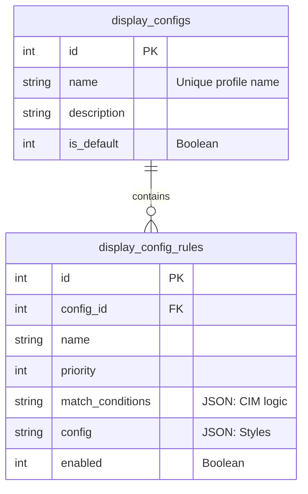
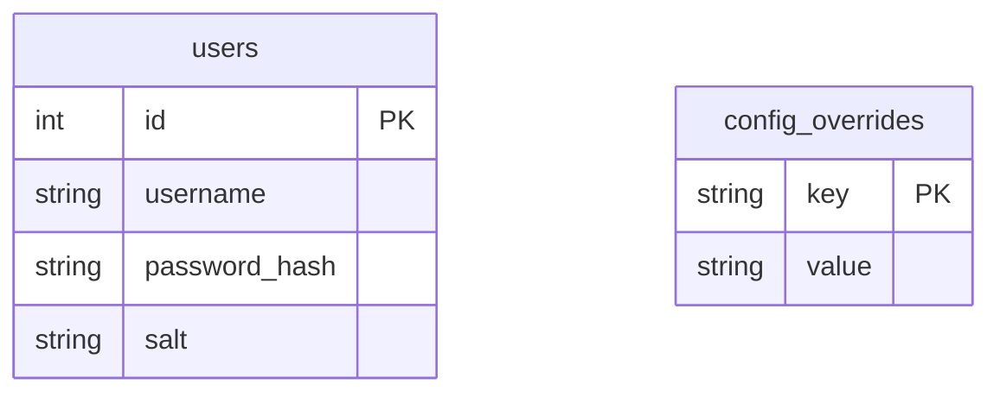

# Database Schema (SQLite)

Griddy utilizes a multi-database SQLite strategy to ensure a clean separation of concerns and a robust security posture.

## Rules Database (`rules.sqlite`)

Manages the visual representation of the grid. The **Admin Console** has full R/W access to this database, while the **Main Backend** connects in **Read-Only** mode to apply styling during topology processing.

## Admin Database (`admin.sqlite`)

Stores sensitive administrative configuration and user credentials. The **Main Backend** uses this for authentication in **Read-Only** mode.

## Table Definitions

### `display_configs`
Defines "Profiles" that can be switched globally. Only one profile is active at a time (marked by `is_default`).

### `display_config_rules`
Individual styling rules.
- **`match_conditions`**: A JSON blob containing CIM class filters, attribute matches, or complex path-based queries.
- **`config`**: A JSON blob defining the visual representation (e.g., `{"color_hex": "#ff0000", "icon": "transformer"}`).

### `users`
Manages access to the Admin Console. Passwords are salted and hashed using PBKDF2-HMAC-SHA256.

### `config_overrides`
Key-value store for dynamic system settings that influence Main Backend behavior without requiring environment variable changes.
